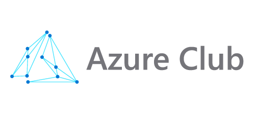

<div align="center">
  
  
  # 🚀 Workshop: Virtual Insurance Advisor
  
  ### Building an Intelligent Assistant for the Insurance Industry using Azure API Management and Azure AI
  
  
  
  
  
  
</div>

---

## 🌍 Language / Język

- **[English Documentation](README-en.md)** EN
- **[Polska Dokumentacja](README.md)** PL

---

## 📋 About the Workshop

This workshop guides participants through the process of creating an advanced API interface for a **virtual insurance advisor** with multi-channel support. The project uses the latest Microsoft Azure technologies to build an intelligent system that can respond to customer questions about insurance policies in real-time.

### 🎯 Workshop Goals

- ✅ Create and manage APIs using **Azure API Management**
- ✅ Integration with **Azure AI Foundry** (GPT-4o-mini) for generative responses
- ✅ Implementation of **vector search** in PostgreSQL for semantic search
- ✅ Configuration of **OAuth 2.0** and API security
- ✅ Building **Smart Load Balancing** between multiple Azure AI regions
- ✅ Monitoring and diagnostics with **Application Insights** and **Log Analytics**
- ✅ Integration with **Logic Apps** for workflow orchestration

---

## 🛠️ Technologies

| Technology | Purpose |
|------------|---------------|
| **Azure API Management** | API management, security, and monitoring |
| **Azure AI Foundry** | GPT models for generative responses |
| **Azure Database for PostgreSQL** | Database with vector search (pgvector) |
| **Azure Functions** | Serverless compute for semantic search |
| **Azure Logic Apps** | Workflow orchestration and integrations |
| **Application Insights** | Application monitoring and telemetry |
| **Log Analytics** | Log centralization and analysis |
| **Microsoft Entra ID** | Authentication and authorization (OAuth 2.0) |
| **Microsoft Fabric** | Data analytics and reporting |

---

## 📚 Repository Structure

```
apim-virtual-insurance-workshop-v2/
│
├── 📄 README-en.md                              # This file (English)
├── 📄 README.md                                 # Main file (Polish)
├── 📄 apim-virtual-insurance-workshop-en.md    # Workshop materials (English)
├── 📄 apim-virtual-insurance-workshop-pl.md    # Workshop materials (Polish)
├── 📄 naming-conventions-en.md                  # Naming conventions (English)
├── 📄 naming-conventions.md                     # Naming conventions (Polish)
├── 🖼️ Logo-Azure-Club.png                       # Azure Club Logo
│
├── 📁 Scripts/                                  # Setup and testing scripts
│   ├── README-en.md                             # Scripts documentation (English)
│   ├── README.md                                # Scripts documentation (Polish)
│   ├── CreateMHusers.ps1                        # User creation script
│   ├── CreateResourceGroups.ps1                 # Resource group creation script
│   ├── Test-SmartLoadBalancing.ps1              # Load balancing test script
│   └── ...                                      # Other helper scripts
│
└── 📁 function/                                 # Azure Function - Vector Search
    ├── function_app.py                          # Main function logic
    ├── host.json                                # Azure Functions configuration
    └── requirements.txt                         # Python dependencies
```

---

## 🚀 Quick Start

### Prerequisites

Before starting the workshop, make sure you have:

- ✅ **Active Azure subscription** (or free credits)
- ✅ **Azure AI Foundry** with GPT-4o-mini model
- ✅ **Azure Log Analytics** (deployed service)
- ✅ **Application Insights** (deployed service)
- ✅ Installed tools:
  - [Azure CLI](https://learn.microsoft.com/cli/azure/install-azure-cli) (version 2.40.0+)
  - [Visual Studio Code](https://code.visualstudio.com/)
  - [Postman](https://www.postman.com/) or other REST client (optional)
- ✅ Basic knowledge of REST API, HTTP, and JSON

### 📖 Workshop Materials

👉 **[Go to full workshop materials (English)](apim-virtual-insurance-workshop-en.md)**

👉 **[Przejdź do pełnych materiałów warsztatowych (Polish)](apim-virtual-insurance-workshop-pl.md)**

The material covers 12 main sections:

1. **Creating the First API** - Policy knowledge base
2. **Integration with Azure AI Foundry** - Adding GPT chatbot
3. **Implementing OAuth 2.0** - Securing access
4. **Orchestration with Logic Apps** - Workflows
5. **Vector Search in PostgreSQL** - Semantic search
6. **Configuring Microsoft Fabric** - Data analytics
7. **Smart Load Balancing** - Multi-region failover
8. **Monitoring and Diagnostics** - Application Insights
9. **Testing and Validation** - PowerShell scripts
10. **Best Practices** - Production readiness

---

## 🎓 Who is this Workshop For?

- 👨‍💻 **Developers** interested in integrating AI with business applications
- 🏗️ **Solution Architects** designing Azure-based systems
- 🔧 **DevOps Engineers** managing cloud infrastructure
- 📊 **Data Engineers** working with vector databases and AI
- 💼 **IT Professionals** from the insurance and FinTech sectors

---

## 🗂️ Naming Conventions

The repository contains detailed naming conventions for all Azure resources:

👉 **[Check naming conventions (English)](naming-conventions-en.md)**

👉 **[Sprawdź konwencje nazewnictwa (Polish)](naming-conventions.md)**

Example structure for user **05**:

```
rg-azureclubworkshopint-05                    # Resource Group
apim-azureclubworkshopint-05                  # API Management
aoai-azureclubworkshopint-05-01               # Azure AI (Primary)
aoai-azureclubworkshopint-05-02               # Azure AI (Secondary)
psql-azureclubworkshopint-05                  # PostgreSQL
func-azureclubworkshopint-05                  # Function App
la-azureclubworkshopint-05                    # Logic App
```

---

## 🧩 Solution Architecture

```
┌─────────────┐
│   Client    │
│  (Postman)  │
└──────┬──────┘
       │
       ▼
┌─────────────────────────────────────────────┐
│     Azure API Management (APIM)             │
│  ┌─────────────────────────────────────┐   │
│  │  PolisyAPI (GET /polisy)            │   │
│  │  ChatAPI (POST /chat)               │   │
│  │  OAuth 2.0 Security                 │   │
│  │  Smart Load Balancing               │   │
│  └─────────────────────────────────────┘   │
└──┬──────────────────┬──────────────────┬───┘
   │                  │                  │
   ▼                  ▼                  ▼
┌─────────┐    ┌─────────────┐   ┌──────────────┐
│ Logic   │    │  Azure AI   │   │  PostgreSQL  │
│  Apps   │    │  Foundry    │   │ + pgvector   │
└─────────┘    │  (GPT-4o)   │   └──────┬───────┘
               └─────────────┘          │
                                        ▼
                                  ┌─────────────┐
                                  │   Azure     │
                                  │  Functions  │
                                  └─────────────┘
```

---

## 🔐 Security

The workshop implements the following security mechanisms:

- 🔑 **OAuth 2.0** - Client Credentials Flow
- 🛡️ **Managed Identity** - Secure access to Azure resources
- 🔐 **API Keys & Secrets** - Azure Key Vault integration
- 🌐 **Virtual Network** - APIM network isolation
- 📊 **Rate Limiting** - Protection against abuse

---

## 📊 Features

### ✨ Main Features

- **Semantic Search** - Vector search in PostgreSQL (pgvector) for intelligent policy search
- **RAG Pattern** - Retrieval-Augmented Generation for precise answers
- **Multi-Region AI** - Smart load balancing between France Central and Sweden Central
- **Real-time Chat** - Interactive chatbot with context memory
- **Policy Management** - CRUD operations for insurance policies
- **Advanced Analytics** - Integration with Microsoft Fabric
- **Comprehensive Monitoring** - Application Insights + Log Analytics

---

## 🤝 Support and Community

- 📧 Questions? Open an [Issue](https://github.com/AzureClub/apim-virtual-insurance-workshop-v2/issues)

---

## 🙏 Acknowledgments

Workshop materials prepared by **Azure Club** for the Polish community of cloud developers and architects.

---

<div align="center">
  
### ⭐ If this workshop was helpful, leave a star!

**Built with ❤️ by [Azure Club]**

</div>
